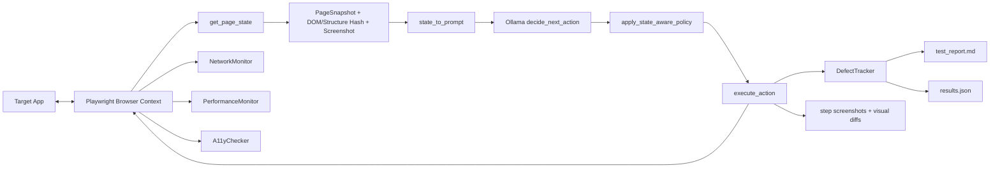

# MonkeyLM: Advanced Smart Monkey Testing Agent

[](https://github.com/<OWNER>/<REPO>/actions/workflows/monkeylm-deep-test.yml)

> Update `<OWNER>/<REPO>` after pushing this repository to GitHub.

An LLM-guided, Playwright-powered monkey testing framework for aggressively exploring web apps and surfacing defects across UX, reliability, accessibility, security, and performance.

This project has two runnable scripts:
- `monkey_agent_advanced.py`: full-featured smart monkey engine with defect tracking and report artifacts.
- `test.py`: lighter baseline version for quick runs and experimentation.

## 🚀 Quick Start

```bash
python3 -m venv .venv
source .venv/bin/activate
pip install -r requirements.txt
playwright install chromium
ollama pull llama3.2

# Optional: copy the example environment file and edit values for your setup.
cp .env.example .env

python3 monkey_agent_advanced.py
```

Environment variables are resolved in this precedence order:
1. CLI flags (highest)
2. Values in a local `.env` file
3. Shell environment variables
4. Built-in defaults (lowest)

Notes:
- The current default model in code is `minimax-m3:cloud`. If you want local Ollama inference, switch to a local model (for example `llama3.2`) in configuration.
- Test artifacts are written into a timestamped folder like `testrun_YYYYMMDD_HHMMSS/`.

## 🧠 Architecture Diagram



## ⚙️ Configuration

The advanced runner now supports both environment-variable configuration and CLI overrides.

### Environment Variables (implemented)

| Variable | Default | Purpose |
|---|---|---|
| `TARGET_URL` | `https://noblequran-85hu2yge.manus.space/dashboard` | Start URL for the monkey run. |
| `OLLAMA_MODEL` | `minimax-m3:cloud` | LLM model used for action planning. |
| `OLLAMA_TIMEOUT_SECONDS` | `15` | Hard timeout in seconds for each Ollama inference call. |
| `MAX_STEPS` | `100` | Number of monkey actions to execute. |
| `WORKERS` | `1` | Maximum number of concurrent worker browser contexts. |
| `MAX_STEPS_PER_WORKER` | `100` | Per-worker step cap. Must be less than or equal to `MAX_STEPS`. |
| `WORKER_NAVIGATION_RETRIES` | `2` | Retry count for initial worker navigation to target URL. |
| `WORKER_QDRANT_INIT_RETRIES` | `1` | Retry count for worker-level Qdrant initialization. |
| `WORKER_BOUNDARY_RECOVERY_RETRIES` | `1` | Retry count for out-of-scope boundary recovery navigation. |
| `RETRY_BASE_DELAY_SECONDS` | `0.75` | Base backoff delay in seconds (exponential with jitter). |
| `HEADLESS` | `true` | Run browser headless when enabled. |
| `BROWSER_WINDOW_SIZE` | `1920,1080` | Browser launch size (`width,height` or `widthxheight`). |
| `NO_VIEWPORT` | `true` | Use window size directly instead of Playwright viewport emulation. |
| `POSTGRES_DSN` | `postgresql://localhost:5432/monkeylm` | PostgreSQL connection string. |
| `REDIS_URL` | `redis://localhost:6379/0` | Redis connection URL for visited-state tracking. |
| `REDIS_PREFIX` | `""` | Optional prefix applied to all Redis keys (for example `monkey:`). |
| `REDIS_PATH_LOCK_TTL_SECONDS` | `45` | TTL for cross-worker action-path Redis locks. Must be 1–300 seconds. |
| `STRICT_SANDBOX` | `false` | If `true`, Chromium must launch in sandbox mode or the run fails. |
| `ALLOW_NO_SANDBOX_FALLBACK` | `false` | If `true`, fallback to `--no-sandbox` is allowed when sandbox launch fails. |

### CLI Overrides

| Flag | Purpose |
|---|---|
| `--target-url` | Override target URL for the run. |
| `--ollama-model` | Override model name for the run. |
| `--ollama-timeout-seconds` | Override Ollama inference timeout. |
| `--max-steps` | Override step budget. |
| `--workers` | Override concurrent worker count. |
| `--max-steps-per-worker` | Override per-worker step cap (must be <= `--max-steps`). |
| `--worker-navigation-retries` | Override retries for initial worker navigation. |
| `--worker-qdrant-init-retries` | Override retries for worker Qdrant initialization. |
| `--worker-boundary-recovery-retries` | Override retries for boundary recovery navigation. |
| `--retry-base-delay-seconds` | Override base retry delay for exponential backoff. |
| `--redis-prefix` | Override Redis key prefix. |
| `--redis-path-lock-ttl-seconds` | Override cross-worker action-path lock TTL. |
| `--window-size` | Override browser window size. |
| `--headless` / `--headed` | Force headless or headed mode. |
| `--no-viewport` / `--use-viewport` | Force viewport behavior. |

Precedence rule:
- CLI flag value wins over environment variable value.

### Example Runs

Environment-driven:

```bash
TARGET_URL="https://example.com/dashboard" \
OLLAMA_MODEL="llama3.2" \
MAX_STEPS=75 \
WORKERS=3 \
MAX_STEPS_PER_WORKER=30 \
WORKER_NAVIGATION_RETRIES=3 \
WORKER_QDRANT_INIT_RETRIES=2 \
WORKER_BOUNDARY_RECOVERY_RETRIES=2 \
RETRY_BASE_DELAY_SECONDS=1.0 \
HEADLESS=true \
BROWSER_WINDOW_SIZE="1600x900" \
NO_VIEWPORT=true \
python3 monkey_agent_advanced.py
```

CLI-driven:

```bash
python3 monkey_agent_advanced.py \
	--target-url "https://example.com/dashboard" \
	--ollama-model "llama3.2" \
	--max-steps 75 \
	--workers 3 \
	--max-steps-per-worker 30 \
	--worker-navigation-retries 3 \
	--worker-qdrant-init-retries 2 \
	--worker-boundary-recovery-retries 2 \
	--retry-base-delay-seconds 1.0 \
	--window-size "1600,900" \
	--headless \
	--no-viewport
```

Step-budget semantics:
- `MAX_STEPS` is the global total budget for the run.
- `MAX_STEPS_PER_WORKER` caps how many steps one worker can consume.
- If `WORKERS * MAX_STEPS_PER_WORKER < MAX_STEPS`, the run will stop after exhausting capped worker allocations.

## 📐 Concurrency Tuning

Use these baseline settings to avoid overloading local CPU, browser processes, and persistence services.

| Host Size | Suggested `WORKERS` | Suggested `MAX_STEPS_PER_WORKER` | Suggested `MAX_STEPS` |
|---|---:|---:|---:|
| 2 vCPU / 4 GB RAM | 1-2 | 25-50 | 50-100 |
| 4 vCPU / 8 GB RAM | 2-4 | 30-75 | 100-250 |
| 8 vCPU / 16 GB RAM | 4-6 | 40-100 | 250-600 |
| 16+ vCPU / 32+ GB RAM | 6-10 | 50-150 | 500-1200 |

Persistence sizing heuristics used by the runner:
- PostgreSQL pool `min_size = min(4, WORKERS)`, `max_size = max(4, WORKERS * 4)`.
- Redis client `max_connections = max(16, WORKERS * 8)`.

Operational guidance:
- Increase `WORKERS` only after verifying browser stability and service latency under load.
- Keep `MAX_STEPS_PER_WORKER` moderate to improve route diversity across workers.
- If PostgreSQL/Redis are remote, start with lower worker counts (for example 1-2) and scale up gradually.
- Prefer `HEADLESS=true` for higher worker density and lower memory pressure.

## 📊 Features

- Smart action loop: `get_page_state -> decide_next_action -> execute_action`.
- Async multi-worker loop with semaphore-bounded concurrency (`--workers`).
- 1920x1080 browser windows with isolated per-worker persistent contexts under `playwright_user_data/session_<timestamp>/worker-XX/`.
- Modal handling with fallback strategy: close button, cancel/dismiss, then `Escape`.
- Form submission paths (`submit` click and `Enter` fallback).
- Fuzzing with blended payloads (realistic + OWASP-style attack strings).
- Network fault injection for API calls (latency and injected 5xx responses).
- Accessibility checks with axe-core (`critical`/`serious` filtering).
- Performance telemetry (CDP metrics, long tasks, JS heap, FPS sampling).
- Visual regression and layout instability detection via screenshot diffing.
- Markdown and JSON reporting (`test_report.md`, `results.json`) plus per-step screenshots.
- Worker startup and boundary-recovery retries with exponential backoff for transient navigation/service failures.

## 🔁 Execution Workflow

1. Allocate global step budget across workers with per-worker caps.
2. Launch one isolated browser context per active worker (sandbox-first, optional no-sandbox fallback).
3. Open target URL and wait for readiness (with retry/backoff).
4. For each worker step, capture state and screenshot (`PageSnapshot`).
5. Ask Ollama for next action in JSON format.
6. Apply state-aware policy to avoid loops and diversify exploration.
7. Execute action and collect post-action telemetry.
8. Record defects, logs, and artifacts per worker, then merge globally.
9. Repeat until allocated global budget is consumed, then generate reports.

## 🔍 Gap Analysis

Based on architecture review, these gaps are currently the highest-impact improvements:

1. Config parity gap:
	- Core runtime knobs are now env-driven and CLI-overridable in the advanced runner.
2. Optional Node fallback dependency gap:
	- Screenshot diff fallback expects `pngjs` and `pixelmatch` in Node, but this is not documented as an optional setup path.
3. Reproducibility gap:
	- No seeded randomness flag, making exact replay difficult.
4. CI ergonomics gap:
	- CLI overrides are available; a ready-made CI workflow template is still not included.
5. Test scope clarity gap:
	- No explicit policy section for allowed domains/rate limits when running against production-like systems.

## 🛠️ Troubleshooting

### Error: `Execution context was destroyed`

Why it happens:
- Navigation occurred between state capture and DOM evaluation.

How this project handles it:
- `get_page_state` retries after waiting for `networkidle` and falls back to a minimal loading snapshot.

What to do if it persists:
- Increase action cooldown.
- Add stricter post-action waits for known route transitions.
- Reduce action aggressiveness for heavy SPA flows.

### Browser launch fails in Linux sandbox mode

Symptoms:
- Launch exception before test loop starts.

Fix options:
- Keep strict mode: set `STRICT_SANDBOX=true` and fix host sandbox support.
- Allow fallback: set `ALLOW_NO_SANDBOX_FALLBACK=true` for environments where sandbox is unavailable.

### No a11y scan results

Possible causes:
- axe-core CDN blocked or CSP restrictions.

Fix:
- Verify outbound access to the axe CDN URL.
- Watch for `axe-injection-failed` entries in report defects.

### Visual diff fallback errors mentioning Node modules

Cause:
- Python pixelmatch path unavailable and Node fallback missing dependencies.

Fix:
- Ensure Python image diff dependencies are installed from `requirements.txt`.
- Or install Node-side fallback modules if you rely on subprocess diffing.

### Configuration validation fails at startup

Common causes:
- `MAX_STEPS_PER_WORKER` is greater than `MAX_STEPS`.
- A retry count is greater than the allowed maximum (`10`).
- `RETRY_BASE_DELAY_SECONDS` is `0` or greater than `10` seconds.

Fix:
- Ensure `MAX_STEPS_PER_WORKER <= MAX_STEPS`.
- Keep retry counts in the `0-10` range.
- Keep `RETRY_BASE_DELAY_SECONDS` between `0.1` and `10.0` seconds.

Example safe values:

```bash
MAX_STEPS=100 \
MAX_STEPS_PER_WORKER=50 \
WORKER_NAVIGATION_RETRIES=2 \
WORKER_QDRANT_INIT_RETRIES=1 \
WORKER_BOUNDARY_RECOVERY_RETRIES=1 \
RETRY_BASE_DELAY_SECONDS=0.75 \
python3 monkey_agent_advanced.py
```

### PostgreSQL database does not exist

Symptom:
- Startup log shows `PostgreSQL initialization failed: database "monkeylm" does not exist`.

Fix:
- Create the database before the first run. For example:

```bash
psql -h latitude -U postgres -c "CREATE DATABASE monkeylm;"
```

- The runner will create the required tables (`app_baselines`, `regression_drift_log`) automatically on first connection.

### Redis authentication fails

Symptom:
- Startup log shows `Redis initialization failed: Authentication required`.

Fix:
- Include the password in `REDIS_URL`:

```bash
REDIS_URL=redis://:your_password@latitude:6379/0
```

### Ollama inference is slow or times out under concurrent workers

Symptom:
- Steps hang, `Ollama inference timed out` warnings appear, or 503/overload errors occur.

Fix:
- Increase the per-call timeout:

```bash
OLLAMA_TIMEOUT_SECONDS=30 python3 monkey_agent_advanced.py
```

- Tune the Ollama server for parallel batch inference. Match parallelism to `WORKERS`:

```bash
export OLLAMA_NUM_PARALLEL=4
export OLLAMA_KV_CACHE_TYPE=q4_0
ollama serve
```

- Reduce `WORKERS` if the model or GPU cannot sustain the concurrent request load.

### Two workers click the same element at the same time

Symptom:
- Duplicate navigation or form submissions appear in logs when `WORKERS > 1`.

Fix:
- Cross-worker deduplication is enabled by default. Each worker claims a Redis
  lock for `(page_route, action, target)` before executing a click, type,
  navigation, modal, or form action. Increase the lock TTL if your pages are
  slow to react:

```bash
REDIS_PATH_LOCK_TTL_SECONDS=90 python3 monkey_agent_advanced.py
```

- Ensure `REDIS_URL` is reachable from all workers and that `REDIS_PREFIX` is
  consistent across processes.

### Stopping a run gracefully

Press **Ctrl+C** (or send `SIGTERM`) once to request a graceful shutdown. Each
worker finishes its current monkey step, closes its browser context, and
returns the completed steps and findings collected so far. The coordinator
merges partial results and generates `test_report.md` and `results.json` before
exiting. Pressing Ctrl+C a second time forces immediate termination.

## 📁 Output Artifacts

Each run creates:
- `test_report.md`: human-readable report.
- `results.json`: structured machine-readable summary.
- `step_*.png`: screenshots for before/after/final phases.
- `visual_diff_step_*.png`: visual diff images when enabled.

## 🤖 CI Example (GitHub Actions)

Use this workflow as a starting point for scheduled or manual deep monkey runs.

```yaml
name: MonkeyLM Deep Test

on:
	workflow_dispatch:
		inputs:
			target_url:
				description: "Target URL"
				required: true
				default: "https://example.com/dashboard"
			ollama_model:
				description: "Ollama model"
				required: true
				default: "llama3.2"
			max_steps:
				description: "Max monkey steps"
				required: true
				default: "50"
	schedule:
		- cron: "0 2 * * *"

jobs:
	monkey-test:
		runs-on: ubuntu-latest
		timeout-minutes: 45

		steps:
			- name: Checkout
				uses: actions/checkout@v4

			- name: Setup Python
				uses: actions/setup-python@v5
				with:
					python-version: "3.11"

			- name: Install dependencies
				run: |
					python -m pip install --upgrade pip
					pip install -r requirements.txt
					playwright install chromium

			- name: Run monkey test
				env:
					TARGET_URL: ${{ github.event.inputs.target_url || 'https://example.com/dashboard' }}
					OLLAMA_MODEL: ${{ github.event.inputs.ollama_model || 'llama3.2' }}
					MAX_STEPS: ${{ github.event.inputs.max_steps || '50' }}
					HEADLESS: "true"
					BROWSER_WINDOW_SIZE: "1920,1080"
					NO_VIEWPORT: "true"
					ALLOW_NO_SANDBOX_FALLBACK: "true"
				run: |
					python3 monkey_agent_advanced.py --headless --no-viewport

			- name: Upload artifacts
				if: always()
				uses: actions/upload-artifact@v4
				with:
					name: monkeylm-artifacts
					path: |
						testrun_*/test_report.md
						testrun_*/results.json
						testrun_*/**/*.png
```

Tips:
- If your runner has no local Ollama service, use a model/backend configuration reachable from CI.
- For stricter Linux hardening, set `STRICT_SANDBOX=true` and remove no-sandbox fallback.

### How To Trigger CI

1. Open the repository in GitHub.
2. Go to Actions -> MonkeyLM Deep Test.
3. Click Run workflow.
4. Provide `target_url`, `ollama_model`, and `max_steps`.
5. Download artifacts from the run summary (`test_report.md`, `results.json`, screenshots).

## 📚 Development Docs

- `docs/ARCHITECTURE.md`
- `docs/EXTENSION_GUIDE.md`
- `docs/TESTING_STRATEGY.md`
- `docs/PROMPT_LIBRARY.md`

These docs are designed for fast “vibe coding” iteration while preserving architectural intent.
