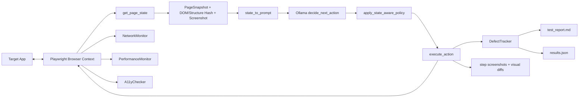

# MonkeyLM: Advanced Smart Monkey Testing Agent

[](https://github.com/<OWNER>/<REPO>/actions/workflows/monkeylm-deep-test.yml)

> Update `<OWNER>/<REPO>` after pushing this repository to GitHub.

An LLM-guided, Playwright-powered monkey testing framework for aggressively exploring web apps and surfacing defects across UX, reliability, accessibility, security, and performance.

This project has two runnable scripts:
- `monkey_agent_advanced.py`: full-featured smart monkey engine with defect tracking and report artifacts.
- `test.py`: lighter baseline version for quick runs and experimentation.

## 🚀 Quick Start

```bash
python3 -m venv .venv
source .venv/bin/activate
pip install -r requirements.txt
playwright install chromium
ollama pull llama3.2
python3 monkey_agent_advanced.py
```

Notes:
- The current default model in code is `minimax-m3:cloud`. If you want local Ollama inference, switch to a local model (for example `llama3.2`) in configuration.
- Test artifacts are written into a timestamped folder like `testrun_YYYYMMDD_HHMMSS/`.

## 🧠 Architecture Diagram



## ⚙️ Configuration

The advanced runner now supports both environment-variable configuration and CLI overrides.

### Environment Variables (implemented)

| Variable | Default | Purpose |
|---|---|---|
| `TARGET_URL` | `https://noblequran-85hu2yge.manus.space/dashboard` | Start URL for the monkey run. |
| `OLLAMA_MODEL` | `minimax-m3:cloud` | LLM model used for action planning. |
| `MAX_STEPS` | `100` | Number of monkey actions to execute. |
| `HEADLESS` | `true` | Run browser headless when enabled. |
| `BROWSER_WINDOW_SIZE` | `1920,1080` | Browser launch size (`width,height` or `widthxheight`). |
| `NO_VIEWPORT` | `true` | Use window size directly instead of Playwright viewport emulation. |
| `STRICT_SANDBOX` | `false` | If `true`, Chromium must launch in sandbox mode or the run fails. |
| `ALLOW_NO_SANDBOX_FALLBACK` | `false` | If `true`, fallback to `--no-sandbox` is allowed when sandbox launch fails. |

### CLI Overrides

| Flag | Purpose |
|---|---|
| `--target-url` | Override target URL for the run. |
| `--ollama-model` | Override model name for the run. |
| `--max-steps` | Override step budget. |
| `--window-size` | Override browser window size. |
| `--headless` / `--headed` | Force headless or headed mode. |
| `--no-viewport` / `--use-viewport` | Force viewport behavior. |

Precedence rule:
- CLI flag value wins over environment variable value.

### Example Runs

Environment-driven:

```bash
TARGET_URL="https://example.com/dashboard" \
OLLAMA_MODEL="llama3.2" \
MAX_STEPS=75 \
HEADLESS=true \
BROWSER_WINDOW_SIZE="1600x900" \
NO_VIEWPORT=true \
python3 monkey_agent_advanced.py
```

CLI-driven:

```bash
python3 monkey_agent_advanced.py \
	--target-url "https://example.com/dashboard" \
	--ollama-model "llama3.2" \
	--max-steps 75 \
	--window-size "1600,900" \
	--headless \
	--no-viewport
```

## 📊 Features

- Smart action loop: `get_page_state -> decide_next_action -> execute_action`.
- 1920x1080 browser window with persistent context (`playwright_user_data/`).
- Modal handling with fallback strategy: close button, cancel/dismiss, then `Escape`.
- Form submission paths (`submit` click and `Enter` fallback).
- Fuzzing with blended payloads (realistic + OWASP-style attack strings).
- Network fault injection for API calls (latency and injected 5xx responses).
- Accessibility checks with axe-core (`critical`/`serious` filtering).
- Performance telemetry (CDP metrics, long tasks, JS heap, FPS sampling).
- Visual regression and layout instability detection via screenshot diffing.
- Markdown and JSON reporting (`test_report.md`, `results.json`) plus per-step screenshots.

## 🔁 Execution Workflow

1. Launch browser context (sandbox-first, optional no-sandbox fallback).
2. Open target URL and wait for readiness.
3. Capture page state and screenshot (`PageSnapshot`).
4. Ask Ollama for next action in JSON format.
5. Apply state-aware policy to avoid loops and diversify exploration.
6. Execute action and collect post-action telemetry.
7. Record defects, logs, and artifacts.
8. Repeat until `MAX_STEPS`, then generate reports.

## 🔍 Gap Analysis

Based on architecture review, these gaps are currently the highest-impact improvements:

1. Config parity gap:
	- Core runtime knobs are now env-driven and CLI-overridable in the advanced runner.
2. Optional Node fallback dependency gap:
	- Screenshot diff fallback expects `pngjs` and `pixelmatch` in Node, but this is not documented as an optional setup path.
3. Reproducibility gap:
	- No seeded randomness flag, making exact replay difficult.
4. CI ergonomics gap:
	- CLI overrides are available; a ready-made CI workflow template is still not included.
5. Test scope clarity gap:
	- No explicit policy section for allowed domains/rate limits when running against production-like systems.

## 🛠️ Troubleshooting

### Error: `Execution context was destroyed`

Why it happens:
- Navigation occurred between state capture and DOM evaluation.

How this project handles it:
- `get_page_state` retries after waiting for `networkidle` and falls back to a minimal loading snapshot.

What to do if it persists:
- Increase action cooldown.
- Add stricter post-action waits for known route transitions.
- Reduce action aggressiveness for heavy SPA flows.

### Browser launch fails in Linux sandbox mode

Symptoms:
- Launch exception before test loop starts.

Fix options:
- Keep strict mode: set `STRICT_SANDBOX=true` and fix host sandbox support.
- Allow fallback: set `ALLOW_NO_SANDBOX_FALLBACK=true` for environments where sandbox is unavailable.

### No a11y scan results

Possible causes:
- axe-core CDN blocked or CSP restrictions.

Fix:
- Verify outbound access to the axe CDN URL.
- Watch for `axe-injection-failed` entries in report defects.

### Visual diff fallback errors mentioning Node modules

Cause:
- Python pixelmatch path unavailable and Node fallback missing dependencies.

Fix:
- Ensure Python image diff dependencies are installed from `requirements.txt`.
- Or install Node-side fallback modules if you rely on subprocess diffing.

## 📁 Output Artifacts

Each run creates:
- `test_report.md`: human-readable report.
- `results.json`: structured machine-readable summary.
- `step_*.png`: screenshots for before/after/final phases.
- `visual_diff_step_*.png`: visual diff images when enabled.

## 🤖 CI Example (GitHub Actions)

Use this workflow as a starting point for scheduled or manual deep monkey runs.

```yaml
name: MonkeyLM Deep Test

on:
	workflow_dispatch:
		inputs:
			target_url:
				description: "Target URL"
				required: true
				default: "https://example.com/dashboard"
			ollama_model:
				description: "Ollama model"
				required: true
				default: "llama3.2"
			max_steps:
				description: "Max monkey steps"
				required: true
				default: "50"
	schedule:
		- cron: "0 2 * * *"

jobs:
	monkey-test:
		runs-on: ubuntu-latest
		timeout-minutes: 45

		steps:
			- name: Checkout
				uses: actions/checkout@v4

			- name: Setup Python
				uses: actions/setup-python@v5
				with:
					python-version: "3.11"

			- name: Install dependencies
				run: |
					python -m pip install --upgrade pip
					pip install -r requirements.txt
					playwright install chromium

			- name: Run monkey test
				env:
					TARGET_URL: ${{ github.event.inputs.target_url || 'https://example.com/dashboard' }}
					OLLAMA_MODEL: ${{ github.event.inputs.ollama_model || 'llama3.2' }}
					MAX_STEPS: ${{ github.event.inputs.max_steps || '50' }}
					HEADLESS: "true"
					BROWSER_WINDOW_SIZE: "1920,1080"
					NO_VIEWPORT: "true"
					ALLOW_NO_SANDBOX_FALLBACK: "true"
				run: |
					python3 monkey_agent_advanced.py --headless --no-viewport

			- name: Upload artifacts
				if: always()
				uses: actions/upload-artifact@v4
				with:
					name: monkeylm-artifacts
					path: |
						testrun_*/test_report.md
						testrun_*/results.json
						testrun_*/**/*.png
```

Tips:
- If your runner has no local Ollama service, use a model/backend configuration reachable from CI.
- For stricter Linux hardening, set `STRICT_SANDBOX=true` and remove no-sandbox fallback.

### How To Trigger CI

1. Open the repository in GitHub.
2. Go to Actions -> MonkeyLM Deep Test.
3. Click Run workflow.
4. Provide `target_url`, `ollama_model`, and `max_steps`.
5. Download artifacts from the run summary (`test_report.md`, `results.json`, screenshots).

## 📚 Development Docs

- `docs/ARCHITECTURE.md`
- `docs/EXTENSION_GUIDE.md`
- `docs/TESTING_STRATEGY.md`
- `docs/PROMPT_LIBRARY.md`

These docs are designed for fast “vibe coding” iteration while preserving architectural intent.
