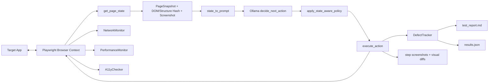

# MonkeyLM: Advanced Smart Monkey Testing Agent

An LLM-guided, Playwright-powered monkey testing framework for aggressively exploring web apps and surfacing defects across UX, reliability, accessibility, security, and performance.

This project has two runnable scripts:
- `monkey_agent_advanced.py`: full-featured smart monkey engine with defect tracking and report artifacts.
- `test.py`: lighter baseline version for quick runs and experimentation.

## 🚀 Quick Start

```bash
python3 -m venv .venv
source .venv/bin/activate
pip install -r requirements.txt
playwright install chromium
ollama pull llama3.2
python monkey_agent_advanced.py
```

Notes:
- The current default model in code is `minimax-m3:cloud`. If you want local Ollama inference, switch to a local model (for example `llama3.2`) in configuration.
- Test artifacts are written into a timestamped folder like `testrun_YYYYMMDD_HHMMSS/`.

## 🧠 Architecture Diagram



## ⚙️ Configuration

The current code uses a mix of hardcoded constants and environment variables.

### Environment Variables (implemented)

| Variable | Default | Purpose |
|---|---|---|
| `STRICT_SANDBOX` | `false` | If `true`, Chromium must launch in sandbox mode or the run fails. |
| `ALLOW_NO_SANDBOX_FALLBACK` | `false` | If `true`, fallback to `--no-sandbox` is allowed when sandbox launch fails. |

### Common Runtime Knobs (currently constants in code)

| Setting | Current Default | Suggested Env Name | Meaning |
|---|---|---|---|
| `TARGET_URL` | `https://noblequran-85hu2yge.manus.space/dashboard` | `TARGET_URL` | Start URL for the monkey run. |
| `OLLAMA_MODEL` | `minimax-m3:cloud` | `OLLAMA_MODEL` | LLM used for action decisions. |
| `MAX_STEPS` | `100` | `MAX_STEPS` | Number of actions to execute. |
| `HEADLESS` | `True` | `HEADLESS` | Run browser in headless mode. |
| Browser args | `--window-size=1920,1080` + `no_viewport=True` | `BROWSER_WINDOW_SIZE` | Controls viewport/window behavior. |
| `ACTION_COOLDOWN_SECONDS` | `1.0` | `ACTION_COOLDOWN_SECONDS` | Delay between actions. |

## 📊 Features

- Smart action loop: `get_page_state -> decide_next_action -> execute_action`.
- 1920x1080 browser window with persistent context (`playwright_user_data/`).
- Modal handling with fallback strategy: close button, cancel/dismiss, then `Escape`.
- Form submission paths (`submit` click and `Enter` fallback).
- Fuzzing with blended payloads (realistic + OWASP-style attack strings).
- Network fault injection for API calls (latency and injected 5xx responses).
- Accessibility checks with axe-core (`critical`/`serious` filtering).
- Performance telemetry (CDP metrics, long tasks, JS heap, FPS sampling).
- Visual regression and layout instability detection via screenshot diffing.
- Markdown and JSON reporting (`test_report.md`, `results.json`) plus per-step screenshots.

## 🔁 Execution Workflow

1. Launch browser context (sandbox-first, optional no-sandbox fallback).
2. Open target URL and wait for readiness.
3. Capture page state and screenshot (`PageSnapshot`).
4. Ask Ollama for next action in JSON format.
5. Apply state-aware policy to avoid loops and diversify exploration.
6. Execute action and collect post-action telemetry.
7. Record defects, logs, and artifacts.
8. Repeat until `MAX_STEPS`, then generate reports.

## 🔍 Gap Analysis

Based on architecture review, these gaps are currently the highest-impact improvements:

1. Config parity gap:
	- `TARGET_URL`, `OLLAMA_MODEL`, `MAX_STEPS`, `HEADLESS`, and viewport are not env-driven yet.
2. Optional Node fallback dependency gap:
	- Screenshot diff fallback expects `pngjs` and `pixelmatch` in Node, but this is not documented as an optional setup path.
3. Reproducibility gap:
	- No seeded randomness flag, making exact replay difficult.
4. CI ergonomics gap:
	- No standard CLI arguments and no ready-made CI workflow template.
5. Test scope clarity gap:
	- No explicit policy section for allowed domains/rate limits when running against production-like systems.

## 🛠️ Troubleshooting

### Error: `Execution context was destroyed`

Why it happens:
- Navigation occurred between state capture and DOM evaluation.

How this project handles it:
- `get_page_state` retries after waiting for `networkidle` and falls back to a minimal loading snapshot.

What to do if it persists:
- Increase action cooldown.
- Add stricter post-action waits for known route transitions.
- Reduce action aggressiveness for heavy SPA flows.

### Browser launch fails in Linux sandbox mode

Symptoms:
- Launch exception before test loop starts.

Fix options:
- Keep strict mode: set `STRICT_SANDBOX=true` and fix host sandbox support.
- Allow fallback: set `ALLOW_NO_SANDBOX_FALLBACK=true` for environments where sandbox is unavailable.

### No a11y scan results

Possible causes:
- axe-core CDN blocked or CSP restrictions.

Fix:
- Verify outbound access to the axe CDN URL.
- Watch for `axe-injection-failed` entries in report defects.

### Visual diff fallback errors mentioning Node modules

Cause:
- Python pixelmatch path unavailable and Node fallback missing dependencies.

Fix:
- Ensure Python image diff dependencies are installed from `requirements.txt`.
- Or install Node-side fallback modules if you rely on subprocess diffing.

## 📁 Output Artifacts

Each run creates:
- `test_report.md`: human-readable report.
- `results.json`: structured machine-readable summary.
- `step_*.png`: screenshots for before/after/final phases.
- `visual_diff_step_*.png`: visual diff images when enabled.

## 📚 Development Docs

- `docs/ARCHITECTURE.md`
- `docs/EXTENSION_GUIDE.md`
- `docs/TESTING_STRATEGY.md`
- `docs/PROMPT_LIBRARY.md`

These docs are designed for fast “vibe coding” iteration while preserving architectural intent.
