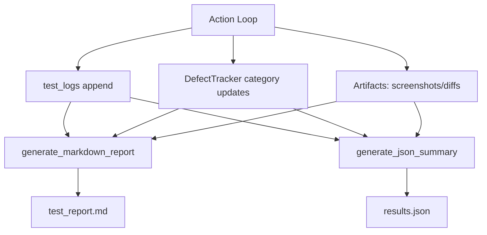

# ARCHITECTURE

## Purpose

`monkey_agent_advanced.py` implements a "smart monkey" loop that combines:
- deterministic browser automation primitives (Playwright),
- probabilistic exploration policy,
- LLM-guided action planning,
- and multi-layer defect instrumentation.

The design goal is simple: maximize behavioral coverage while preserving enough state and telemetry to explain failures.

## High-Level Components

- **Browser Orchestrator**: Launches Chromium persistent context and page lifecycle.
- **State Extractor**: Builds `PageSnapshot` from DOM structure, interactives, modal/spinner counts, and screenshot.
- **Planner (LLM)**: Converts state text into one action (`click`, `type`, `submit_form`, `handle_modal`, `scroll`).
- **Policy Guardrail**: Overrides plans in loop states (`random_jump`, `restart_target`) and diversifies repeated clicks.
- **Action Executor**: Performs action with robust fallbacks and captures post-action telemetry.
- **Monitors**:
  - `NetworkMonitor`: latency/5xx fault injection + zombie UI checks.
  - `PerformanceMonitor`: long tasks, heap deltas, FPS drops.
  - `A11yChecker`: periodic axe scans.
- **Defect Aggregator**: `DefectTracker` stores findings by category.
- **Reporters**: markdown (`test_report.md`) and JSON (`results.json`).

## Core Loop Deep Dive

The center of gravity is:

`get_page_state` -> `decide_next_action` -> `execute_action`

### 1) `get_page_state(page, step_num, phase)`

Responsibilities:
- waits for `domcontentloaded` best-effort,
- evaluates DOM via `capture_dom_and_layout`,
- retries if Playwright context was reset (`Execution context was destroyed`),
- computes two hashes:
  - `dom_hash`: element text-sensitive fingerprint,
  - `structure_hash`: text-normalized structural fingerprint,
- captures full-page screenshot.

Result: immutable `PageSnapshot` object used for planning and drift detection.

### 2) `decide_next_action(page_state)`

Responsibilities:
- sends the textual state prompt to Ollama,
- enforces JSON-only response contract in prompt,
- parses response to dict,
- falls back to `scroll` on parsing/runtime failure.

Design tradeoff:
- soft failure behavior keeps long runs alive even with model output noise.

### 3) `execute_action(...)`

Responsibilities:
- captures pre-action snapshot + performance baseline,
- executes selected action branch,
- captures post-action snapshot + performance delta,
- emits defects for layout, visual, performance, race/zombie, and security signals,
- appends stable log record for reports.

Notable action fallbacks:
- modal close fallback chain,
- form submit fallback chain,
- input target fallback to first visible control.

## Smart DOM Diffing Strategy

There are two complementary diff strategies:

1. **Semantic structure hash**
- Built from normalized tags with stripped text content.
- Used in state memory key: `url::structure_hash`.
- Helps detect revisits independent of dynamic text churn.

2. **Visual/layout drift checks**
- **Anchor-based layout shift**: compares stable anchor coordinates and computes max shift in pixels.
- **Screenshot pixel diff**: Python pixelmatch first, Node fallback second.

Together, these detect both invisible structural loops and visible UI regressions.

## Persistent Context Strategy

The browser runs with:

```python
launch_persistent_context(user_data_dir="./playwright_user_data", no_viewport=True, ...)
```

Why this matters:
- preserves cookies/session storage across runs,
- enables realistic authenticated journeys,
- reduces re-login overhead in long tests.

Operational caution:
- persistent profiles can accumulate stale data. For deterministic CI, use isolated user-data folders per run.

## Data Flow: Reporting Pipeline



## Execution Sequence (Expanded)

1. `launch_context_with_fallback`
2. `page.goto(TARGET_URL)`
3. install monitors (`NETWORK_MONITOR`, `PERF_MONITOR`)
4. loop `step in 1..MAX_STEPS`
5. plan snapshot + state memoization
6. LLM plan + state-aware policy override
7. execute action + telemetry
8. periodic a11y scan (`step % 5 == 0`)
9. reflected-input probe
10. cooldown sleep
11. finalize with markdown + JSON reports

## Architectural Strengths

- Layered observability with low coupling.
- Failure-tolerant state extraction and action execution.
- Clear defect taxonomy suitable for CI post-processing.
- Flexible policy insertion point (`apply_state_aware_policy`).

## Known Architectural Gaps

- Most runtime knobs are not env-driven yet.
- No global seed control for reproducibility.
- Planner output schema is not strictly validated.
- Optional Node fallback dependencies are not self-checked at startup.
- No plugin registry for action handlers (currently `if/elif`).

## Suggested Next Evolution

1. Introduce `ActionRegistry` mapping action names to handler callables.
2. Add typed response validation for LLM output.
3. Promote constants to env/CLI config.
4. Add deterministic mode with seeded RNG and deterministic payload strategy.
5. Add per-domain safety and rate-limit policy.
