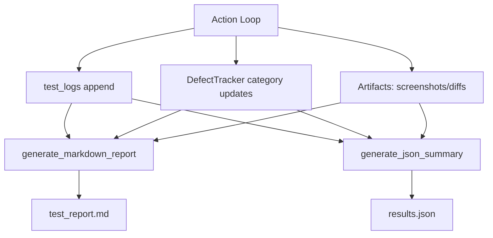

# ARCHITECTURE

## Purpose

`monkey_agent_advanced.py` implements a semaphore-limited, async multi-worker "smart monkey" engine that combines:
- deterministic browser automation primitives (Playwright),
- probabilistic exploration policy,
- LLM-guided action planning,
- and multi-layer defect instrumentation.

The design goal is simple: maximize behavioral coverage in parallel while preserving enough state and telemetry to explain failures deterministically.

## High-Level Components

- **Coordinator**: Partitions total step budget across workers and schedules worker tasks under `asyncio.Semaphore(WORKERS)`.
- **Worker Runtime**: Each worker owns its own Chromium persistent context, page lifecycle, local monitors, and local defect/log buffers.
- **State Extractor**: Builds `PageSnapshot` from DOM structure, interactives, modal/spinner counts, and screenshot.
- **Planner (LLM)**: Converts state text into one action (`click`, `type`, `submit_form`, `handle_modal`, `scroll`).
- **Policy Guardrail**: Overrides plans in loop states (`random_jump`, `restart_target`) and diversifies repeated clicks.
- **Action Executor**: Performs action with robust fallbacks and captures post-action telemetry.
- **Monitors**:
  - `NetworkMonitor`: latency/5xx fault injection + zombie UI checks.
  - `PerformanceMonitor`: long tasks, heap deltas, FPS drops.
  - `A11yChecker`: periodic axe scans.
- **Defect Aggregator**: worker-local `DefectTracker` instances are merged into a final global tracker.
- **Reporters**: markdown (`test_report.md`) and JSON (`results.json`).

## Core Loop Deep Dive

The center of gravity per worker is:

`get_page_state` -> `decide_next_action` -> `execute_action`

### 1) `get_page_state(page, step_num, phase)`

Responsibilities:
- waits for `domcontentloaded` best-effort,
- evaluates DOM via `capture_dom_and_layout`,
- retries if Playwright context was reset (`Execution context was destroyed`),
- computes two hashes:
  - `dom_hash`: element text-sensitive fingerprint,
  - `structure_hash`: text-normalized structural fingerprint,
- captures full-page screenshot.

Result: immutable `PageSnapshot` object used for planning and drift detection.

### 2) `decide_next_action(page_state)`

Responsibilities:
- sends the textual state prompt to Ollama,
- enforces JSON-only response contract in prompt,
- parses response to dict,
- falls back to `scroll` on parsing/runtime failure.

Design tradeoff:
- soft failure behavior keeps long runs alive even with model output noise.

### 3) `execute_action(...)`

Responsibilities:
- captures pre-action snapshot + performance baseline,
- executes selected action branch,
- captures post-action snapshot + performance delta,
- emits defects for layout, visual, performance, race/zombie, and security signals,
- appends stable log record for reports.

Notable action fallbacks:
- modal close fallback chain,
- form submit fallback chain,
- input target fallback to first visible control.

## Smart DOM Diffing Strategy

There are two complementary diff strategies:

1. **Semantic structure hash**
- Built from normalized tags with stripped text content.
- Used in state memory key: `url::structure_hash`.
- Helps detect revisits independent of dynamic text churn.

2. **Visual/layout drift checks**
- **Anchor-based layout shift**: compares stable anchor coordinates and computes max shift in pixels.
- **Screenshot pixel diff**: Python pixelmatch first, Node fallback second.

Together, these detect both invisible structural loops and visible UI regressions.

## Isolated Persistent Context Strategy

Each active worker runs with an isolated persistent profile folder:

```python
launch_persistent_context(
  user_data_dir="./playwright_user_data/session_<timestamp>/worker-XX",
  no_viewport=True,
  ...,
)
```

Why this matters:
- preserves cookies/session storage across runs,
- isolates worker state and storage footprints from other concurrent workers,
- enables realistic authenticated journeys,
- reduces re-login overhead in long tests.

Operational caution:
- persistent profiles can accumulate stale data. The current design isolates by run and worker to reduce cross-run contamination.

## Concurrency and Budget Semantics

- `MAX_STEPS` is the global total step budget.
- `WORKERS` is the max number of active concurrent worker tasks.
- `MAX_STEPS_PER_WORKER` caps each worker's step consumption and must be less than or equal to `MAX_STEPS`.
- The coordinator allocates steps round-robin per worker until the global budget is consumed or worker caps are exhausted.

## Retry and Backoff

Worker startup and critical navigation paths use retry/backoff for transient failures:
- initial target navigation,
- Qdrant worker initialization,
- boundary recovery navigation.

Backoff behavior is exponential with jitter and logs each retry attempt.

Runtime retry controls:
- `WORKER_NAVIGATION_RETRIES`
- `WORKER_QDRANT_INIT_RETRIES`
- `WORKER_BOUNDARY_RECOVERY_RETRIES`
- `RETRY_BASE_DELAY_SECONDS`

## Operational Tuning

Recommended scaling sequence:
1. Increase `WORKERS` gradually.
2. Observe browser launch time, action latency, and error rates.
3. Confirm PostgreSQL and Redis stay below saturation.
4. Increase total step budget only after worker stability is confirmed.

Current persistence sizing strategy in code:
- PostgreSQL pool: `min_size = min(4, WORKERS)`, `max_size = max(4, WORKERS * 4)`.
- Redis max connections: `max(16, WORKERS * 8)`.
- Write-path throttling: semaphore-protected PostgreSQL and Redis write sections.

Tradeoff:
- Higher worker counts improve exploration breadth, but can reduce per-worker determinism and increase service pressure.

## Data Flow: Reporting Pipeline



## Execution Sequence (Expanded)

1. Coordinator validates configuration and allocates global steps across workers.
2. Worker task starts under semaphore concurrency guard.
3. `launch_context_with_fallback` for the worker profile directory.
4. `page.goto(TARGET_URL)` with retry/backoff.
5. install worker-local monitors and memory store.
6. loop through worker-allocated steps.
7. plan snapshot + state memoization.
8. LLM plan + state-aware policy override.
9. execute action + telemetry.
10. periodic a11y scan (`step % 5 == 0`).
11. reflected-input probe + cooldown sleep.
12. coordinator merges worker outputs and emits markdown + JSON reports.

## Architectural Strengths

- Layered observability with low coupling.
- Failure-tolerant state extraction and action execution.
- Clear defect taxonomy suitable for CI post-processing.
- Flexible policy insertion point (`apply_state_aware_policy`).

## Known Architectural Gaps

- Planner output schema is not strictly validated beyond lightweight parsing.
- Optional Node fallback dependencies are not self-checked at startup.
- No plugin registry for action handlers (currently `if/elif`).
- Shared persistence services are still single-instance dependencies (no sharding).

## Suggested Next Evolution

1. Introduce `ActionRegistry` mapping action names to handler callables.
2. Add typed response validation for LLM output.
3. Promote constants to env/CLI config.
4. Add deterministic mode with seeded RNG and deterministic payload strategy.
5. Add per-domain safety and rate-limit policy.
